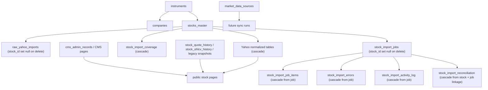

# Riddra Clean Stock Database Reset Plan

Last updated: 2026-04-28 IST

## Purpose

This document defines a **safe, staged, non-destructive planning approach** for resetting Riddra stock data before a clean re-import.

This step is planning only.

What this document does:

- maps the current stock-related tables and dependencies
- separates **safe-to-clear generated data** from **must-preserve system data**
- provides backup/export steps
- provides staging reset SQL
- provides production reset SQL that must be manually approved
- defines the re-import sequence after reset
- defines rollback and approval checks

What this document does **not** do:

- execute any deletion
- drop migrations
- delete users, admin settings, or CMS data by default

## Reset Principles

1. Preserve system integrity first.
2. Prefer clearing **generated stock data** before touching canonical catalog or editorial records.
3. Preserve useful audit and import evidence unless there is a specific reason to purge it.
4. Keep `raw_yahoo_imports` unless a truly pristine replay is required.
5. Treat `stocks_master`, `instruments`, `companies`, and stock CMS records as a separate approval boundary.
6. Run staging reset first. Production reset must be manual and approved.

## 1. Current Stock-Related Tables And Dependency Map

### 1.1 Table groups

| Group | Tables | Default action | Notes |
|---|---|---|---|
| Canonical stock catalog | `instruments`, `companies`, `stocks_master` | Preserve | These anchor slugs, symbols, and stock identity. Do not clear by default. |
| Legacy stock public-market data | `stock_quote_history`, `stock_ohlcv_history`, `stock_fundamental_snapshots`, `stock_shareholding_snapshots`, `stock_pages` | Optional reset | Clear only if the goal is a fully clean public stock-data rebuild. |
| Yahoo raw import archive | `raw_yahoo_imports` | Preserve by default | This is the best forensic backup of what Yahoo returned. |
| Yahoo normalized stock data | `stock_company_profile`, `stock_price_history`, `stock_market_snapshot`, `stock_valuation_metrics`, `stock_share_statistics`, `stock_financial_highlights`, `stock_income_statement`, `stock_balance_sheet`, `stock_cash_flow`, `stock_dividends`, `stock_splits`, `stock_corporate_actions`, `stock_earnings_events`, `stock_earnings_trend`, `stock_analyst_ratings`, `stock_holders_summary`, `stock_holders_detail`, `stock_options_contracts`, `stock_news`, `stock_technical_indicators`, `stock_performance_metrics`, `stock_growth_metrics`, `stock_health_ratios`, `stock_riddra_scores` | Safe clear | These are generated/imported facts and derived layers. |
| Yahoo import operations | `stock_import_jobs`, `stock_import_job_items`, `stock_import_errors`, `stock_import_coverage`, `stock_import_activity_log`, `stock_import_reconciliation` | Preserve by default, clear only after backup if needed | Useful for audit, failure analysis, and rate-limit history. |
| Source registry and sync config | `market_data_sources`, `data_sources` | Preserve | Needed to restart sources and scheduling safely after reset. |
| Admin/CMS/editorial | `cms_admin_records`, `cms_admin_record_revisions`, `cms_admin_pending_approvals`, `cms_admin_activity_log`, `cms_admin_refresh_jobs`, `cms_admin_import_batches`, `cms_admin_import_rows` | Preserve | Do not clear in stock reset unless a separate editorial reset is approved. |
| Users and auth | `auth.users`, `product_user_profiles` | Preserve | Must never be part of stock-data reset. |
| Migrations / platform metadata | `supabase_migrations.schema_migrations` and Supabase-managed metadata | Preserve | Never clear. |

### 1.2 Dependency behavior that matters for reset planning

Key FK behavior from the current Yahoo schema:

- `stocks_master.instrument_id -> instruments.id` uses `on delete set null`
- `raw_yahoo_imports.stock_id -> stocks_master.id` uses `on delete set null`
- Most normalized Yahoo fact tables use `stock_id -> stocks_master.id on delete cascade`
- `stock_import_jobs.stock_id -> stocks_master.id` uses `on delete set null`
- `stock_import_job_items.job_id -> stock_import_jobs.id` uses `on delete cascade`
- `stock_import_errors.job_id -> stock_import_jobs.id` uses `on delete cascade`
- `stock_import_coverage.stock_id -> stocks_master.id` uses `on delete cascade`
- `stock_import_activity_log.job_id -> stock_import_jobs.id` uses `on delete cascade`
- `stock_import_reconciliation.stock_id -> stocks_master.id` uses `on delete cascade`

### 1.3 Dependency map



## 2. Which Tables Can Be Safely Cleared

### 2.1 Recommended reset scope: generated stock data only

These tables are safe reset candidates because they are imported, normalized, or derived:

- `stock_company_profile`
- `stock_price_history`
- `stock_market_snapshot`
- `stock_valuation_metrics`
- `stock_share_statistics`
- `stock_financial_highlights`
- `stock_income_statement`
- `stock_balance_sheet`
- `stock_cash_flow`
- `stock_dividends`
- `stock_splits`
- `stock_corporate_actions`
- `stock_earnings_events`
- `stock_earnings_trend`
- `stock_analyst_ratings`
- `stock_holders_summary`
- `stock_holders_detail`
- `stock_options_contracts`
- `stock_news`
- `stock_technical_indicators`
- `stock_performance_metrics`
- `stock_growth_metrics`
- `stock_health_ratios`
- `stock_riddra_scores`
- `stock_import_coverage`

### 2.2 Optional extended reset scope: legacy stock public data

Only clear these if the goal is a fully clean stock-market rebuild and you explicitly want to remove older stock market history as well:

- `stock_quote_history`
- `stock_ohlcv_history`
- `stock_fundamental_snapshots`
- `stock_shareholding_snapshots`

### 2.3 Optional forensic reset scope: raw + import logs

Only clear these **after backup/export** and only if you need a totally clean operational history:

- `raw_yahoo_imports`
- `stock_import_jobs`
- `stock_import_job_items`
- `stock_import_errors`
- `stock_import_activity_log`
- `stock_import_reconciliation`

## 3. Which Tables Must Be Preserved

These should be preserved in the default reset plan:

- users:
  - `auth.users`
  - `product_user_profiles`
- admin settings and operator config:
  - launch config / runtime config tables or files
  - `cms_admin_refresh_jobs`
  - `data_sources`
- source registry:
  - `market_data_sources`
- import logs if useful:
  - preserve `raw_yahoo_imports` and `stock_import_*` tables by default
- migrations:
  - `supabase_migrations.schema_migrations`
- CMS pages not directly tied to old stock rows:
  - non-stock `cms_admin_records`
  - all non-stock revisions and approvals
- stock CMS/editorial records:
  - preserve by default unless there is a separate editorial cleanup decision

Important note:

- `stocks_master`, `instruments`, and `companies` should also be preserved in the **default** reset.
- If a full stock-universe rebuild is later approved, treat that as **Phase 2 reset**, not part of the first safe cleanup.

## 4. Backup / Export Plan Before Any Deletion

Run these steps before any reset in staging or production.

### 4.1 Database backups

1. Take a full Supabase/Postgres backup or snapshot.
2. Record the backup id, timestamp, and operator.
3. Confirm restore access before running any reset SQL.

### 4.2 Table-level exports

Export at minimum:

- `stocks_master`
- `raw_yahoo_imports`
- all `stock_import_*` tables
- all normalized Yahoo tables
- legacy stock public data tables if they are in scope
- `market_data_sources`
- `cms_admin_records` for family `stocks` if there is any chance stock pages may need editorial rollback

### 4.3 In-database snapshot backups

For staging and production, create backup copies inside a dedicated backup schema before deleting:

- `reset_backup.stocks_master__<run_id>`
- `reset_backup.raw_yahoo_imports__<run_id>`
- `reset_backup.stock_price_history__<run_id>`
- `reset_backup.stock_market_snapshot__<run_id>`
- `reset_backup.stock_import_jobs__<run_id>`
- `reset_backup.stock_import_job_items__<run_id>`
- `reset_backup.stock_import_errors__<run_id>`
- `reset_backup.stock_import_activity_log__<run_id>`
- `reset_backup.stock_import_reconciliation__<run_id>`
- plus any additional tables included in the chosen scope

Use a run id such as:

- `20260428_staging_reset_01`
- `20260428_prod_reset_01`

## 5. Staging Reset SQL

### 5.1 Backup SQL first

```sql
create schema if not exists reset_backup;

create table reset_backup.stocks_master__20260428_staging_reset_01 as
select * from public.stocks_master;

create table reset_backup.raw_yahoo_imports__20260428_staging_reset_01 as
select * from public.raw_yahoo_imports;

create table reset_backup.stock_import_jobs__20260428_staging_reset_01 as
select * from public.stock_import_jobs;

create table reset_backup.stock_import_job_items__20260428_staging_reset_01 as
select * from public.stock_import_job_items;

create table reset_backup.stock_import_errors__20260428_staging_reset_01 as
select * from public.stock_import_errors;

create table reset_backup.stock_import_activity_log__20260428_staging_reset_01 as
select * from public.stock_import_activity_log;

create table reset_backup.stock_import_reconciliation__20260428_staging_reset_01 as
select * from public.stock_import_reconciliation;

create table reset_backup.stock_price_history__20260428_staging_reset_01 as
select * from public.stock_price_history;

create table reset_backup.stock_market_snapshot__20260428_staging_reset_01 as
select * from public.stock_market_snapshot;
```

### 5.2 Recommended staging reset: generated Yahoo stock data only

This keeps users, CMS, source registry, raw Yahoo payloads, and import logs.

```sql
begin;

delete from public.stock_riddra_scores;
delete from public.stock_health_ratios;
delete from public.stock_growth_metrics;
delete from public.stock_performance_metrics;
delete from public.stock_technical_indicators;
delete from public.stock_news;
delete from public.stock_options_contracts;
delete from public.stock_holders_detail;
delete from public.stock_holders_summary;
delete from public.stock_analyst_ratings;
delete from public.stock_earnings_trend;
delete from public.stock_earnings_events;
delete from public.stock_corporate_actions;
delete from public.stock_splits;
delete from public.stock_dividends;
delete from public.stock_cash_flow;
delete from public.stock_balance_sheet;
delete from public.stock_income_statement;
delete from public.stock_financial_highlights;
delete from public.stock_share_statistics;
delete from public.stock_valuation_metrics;
delete from public.stock_market_snapshot;
delete from public.stock_price_history;
delete from public.stock_company_profile;
delete from public.stock_import_coverage;

commit;
```

### 5.3 Optional staging reset: include legacy public stock market data

Run only if you want the public stock pages rebuilt from clean history/snapshot state.

```sql
begin;

delete from public.stock_quote_history;
delete from public.stock_ohlcv_history;
delete from public.stock_fundamental_snapshots;
delete from public.stock_shareholding_snapshots;

commit;
```

### 5.4 Optional staging reset: clear raw Yahoo payloads and import logs too

Run only after backups are confirmed and only if you want a totally clean import history.

```sql
begin;

delete from public.stock_import_activity_log;
delete from public.stock_import_reconciliation;
delete from public.stock_import_errors;
delete from public.stock_import_job_items;
delete from public.stock_import_jobs;
delete from public.raw_yahoo_imports;

commit;
```

### 5.5 Staging verification after reset

```sql
select 'stock_price_history' as table_name, count(*) as row_count from public.stock_price_history
union all
select 'stock_market_snapshot', count(*) from public.stock_market_snapshot
union all
select 'stock_valuation_metrics', count(*) from public.stock_valuation_metrics
union all
select 'stock_income_statement', count(*) from public.stock_income_statement
union all
select 'stock_import_coverage', count(*) from public.stock_import_coverage
union all
select 'market_data_sources', count(*) from public.market_data_sources
union all
select 'cms_admin_activity_log', count(*) from public.cms_admin_activity_log;
```

## 6. Production Reset SQL

**Manual approval required.**

Only run after:

- full backup is confirmed
- staging reset and re-import have passed
- frontend/admin smoke tests are green
- operator signs off on the exact scope

### 6.1 Production backup SQL

```sql
create schema if not exists reset_backup;

create table reset_backup.stocks_master__20260428_prod_reset_01 as
select * from public.stocks_master;

create table reset_backup.raw_yahoo_imports__20260428_prod_reset_01 as
select * from public.raw_yahoo_imports;

create table reset_backup.stock_import_jobs__20260428_prod_reset_01 as
select * from public.stock_import_jobs;

create table reset_backup.stock_import_job_items__20260428_prod_reset_01 as
select * from public.stock_import_job_items;

create table reset_backup.stock_import_errors__20260428_prod_reset_01 as
select * from public.stock_import_errors;

create table reset_backup.stock_import_activity_log__20260428_prod_reset_01 as
select * from public.stock_import_activity_log;

create table reset_backup.stock_import_reconciliation__20260428_prod_reset_01 as
select * from public.stock_import_reconciliation;
```

### 6.2 Production reset: recommended safe scope

```sql
begin;

delete from public.stock_riddra_scores;
delete from public.stock_health_ratios;
delete from public.stock_growth_metrics;
delete from public.stock_performance_metrics;
delete from public.stock_technical_indicators;
delete from public.stock_news;
delete from public.stock_options_contracts;
delete from public.stock_holders_detail;
delete from public.stock_holders_summary;
delete from public.stock_analyst_ratings;
delete from public.stock_earnings_trend;
delete from public.stock_earnings_events;
delete from public.stock_corporate_actions;
delete from public.stock_splits;
delete from public.stock_dividends;
delete from public.stock_cash_flow;
delete from public.stock_balance_sheet;
delete from public.stock_income_statement;
delete from public.stock_financial_highlights;
delete from public.stock_share_statistics;
delete from public.stock_valuation_metrics;
delete from public.stock_market_snapshot;
delete from public.stock_price_history;
delete from public.stock_company_profile;
delete from public.stock_import_coverage;

commit;
```

### 6.3 Production reset: optional extended scope

Only run with explicit approval if the team wants a fully clean public stock-data rebuild too.

```sql
begin;

delete from public.stock_quote_history;
delete from public.stock_ohlcv_history;
delete from public.stock_fundamental_snapshots;
delete from public.stock_shareholding_snapshots;

commit;
```

### 6.4 Production reset that is **not** recommended as part of first cleanup

Do **not** run this unless there is separate approval for a stock-catalog rebuild:

- delete from `stocks_master`
- delete from `instruments`
- delete from `companies`
- delete stock family rows from `cms_admin_records`

That is a second reset boundary because it affects slug ownership, stock pages, mappings, and editor workflows.

## 7. Post-Reset Import Plan

Run in this order:

### Stage 1: canonical stock universe

1. Rebuild or verify `stocks_master` from the approved stock universe.
2. Confirm:
   - slug
   - symbol
   - yahoo symbol
   - exchange
   - status

### Stage 2: one-stock proof

1. Import `RELIANCE.NS`
2. Verify:
   - `stock_price_history`
   - `stock_market_snapshot`
   - `stock_import_coverage`
   - `stock_import_activity_log`
   - `stock_import_reconciliation`
   - `/stocks/reliance-industries`
   - `/admin/market-data/stocks`

### Stage 3: 5-stock pilot

Import:

- `RELIANCE.NS`
- `TCS.NS`
- `INFY.NS`
- `HDFCBANK.NS`
- `ICICIBANK.NS`

Verify:

- per-stock success/failure
- request pace
- missing fields
- frontend route health

### Stage 4: 22-stock pilot

Run the current known active NSE universe pilot:

- import only missing data
- one worker
- 1 request per second

Verify:

- error rate
- quoteSummary availability rate
- dashboard percentages

### Stage 5: 50-stock pilot

Only if:

- the 22-stock pilot is stable
- quote/statistics and financial-statement behavior is understood
- no uncontrolled provider blocking is observed

### Stage 6: staged 2,000-stock import

Recommended progression:

1. 50
2. 250
3. 500
4. remaining

Always:

- `importOnlyMissingData = true`
- selected modules only
- 1 worker
- 1 request/second default

## 8. Rollback Plan

If reset or re-import goes wrong:

1. Stop all running Yahoo jobs and sync actions.
2. Restore affected tables from `reset_backup`.
3. Re-run schema cache reload if needed:
   - `notify pgrst, 'reload schema';`
4. Verify:
   - `/admin/market-data/stocks`
   - `/stocks/reliance-industries`
   - source registry still present
   - activity log still readable

### 8.1 Example rollback pattern

```sql
begin;

insert into public.stock_price_history
select * from reset_backup.stock_price_history__20260428_prod_reset_01;

insert into public.stock_market_snapshot
select * from reset_backup.stock_market_snapshot__20260428_prod_reset_01;

insert into public.stock_import_jobs
select * from reset_backup.stock_import_jobs__20260428_prod_reset_01;

insert into public.stock_import_job_items
select * from reset_backup.stock_import_job_items__20260428_prod_reset_01;

insert into public.stock_import_errors
select * from reset_backup.stock_import_errors__20260428_prod_reset_01;

commit;
```

Practical note:

- real rollback SQL should be tailored per chosen reset scope
- for large tables, `truncate + restore` or `delete + restore` order must respect FKs

## 9. Final Approval Checklist

Before any reset:

- [ ] Exact reset scope chosen:
  - generated Yahoo data only
  - generated Yahoo + legacy stock public data
  - extended log/raw cleanup
- [ ] Full database backup completed
- [ ] In-database backup tables created
- [ ] `market_data_sources` confirmed preserved
- [ ] users and admin settings confirmed preserved
- [ ] CMS/editorial records confirmed preserved
- [ ] staging reset tested successfully
- [ ] RELIANCE one-stock re-import tested successfully in staging
- [ ] admin dashboard returns `200`
- [ ] stock frontend route returns `200`
- [ ] rollback owner assigned
- [ ] production reset explicitly approved by operator/product owner

## Recommended First Reset Scope

For the first clean run, the safest recommendation is:

1. Preserve:
   - `stocks_master`
   - `instruments`
   - `companies`
   - `market_data_sources`
   - `raw_yahoo_imports`
   - `stock_import_jobs`
   - `stock_import_job_items`
   - `stock_import_errors`
   - `stock_import_activity_log`
   - `stock_import_reconciliation`
   - users / admin settings / CMS
2. Clear:
   - normalized Yahoo stock data tables
   - `stock_import_coverage`
3. Optionally clear:
   - legacy public stock market-data tables only if you want a fully clean stock-page rebuild

That gives a clean, low-risk restart point without destroying identity, editor content, or forensic evidence.
