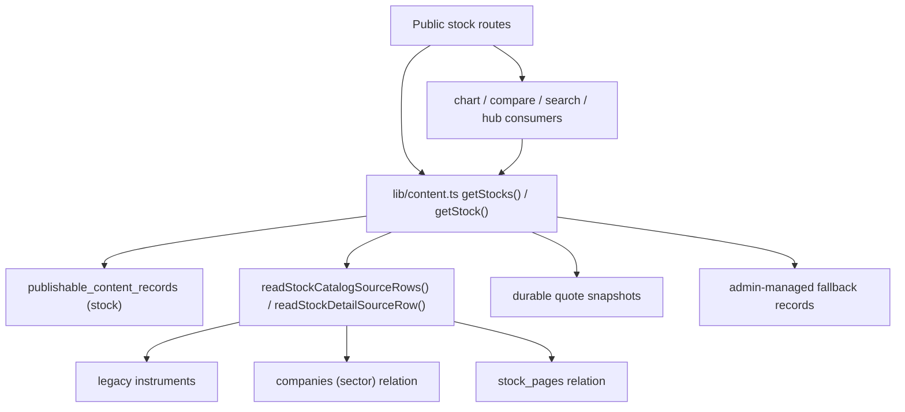

# Riddra Legacy Stock Layer Audit

Date: 2026-04-29  
Scope: legacy `instruments` / `companies` stock layer versus canonical `stocks_master`, based on live Supabase reads and current app route dependencies.

## Executive Summary

- `stocks_master` is now the canonical import universe with `2157` active NSE stocks.
- The legacy public stock layer is still only `22` active stock `instruments`.
- All `22` active stock `instruments` already exist in `stocks_master`.
- There are `0` active legacy stock instruments that are missing from `stocks_master`.
- Public stock route support is still effectively limited to `22` stock pages because `publishable_content_records` for `stock` is only `22` rows, and every one of those rows is still backed by `source_table = instruments`.
- That means `2135` active `stocks_master` rows still do not have public stock page support.
- Deleting or deactivating old `instruments` now would be high risk because the public stock hub, detail pages, compare routes, chart routes, and several search/discovery surfaces still flow through `getStocks()` / `getStock()` and legacy source backing.

## 1. Total Active `stocks_master` Rows

| Metric | Value |
|---|---:|
| Active `stocks_master` rows (`exchange = NSE`, `status = active`) | `2157` |
| `stocks_master` rows with `instrument_id` populated | `22` |
| `stocks_master` rows with no linked legacy instrument support | `2135` |

Notes:
- `stocks_master` already carries its own `slug`, `symbol`, `company_name`, `yahoo_symbol`, `exchange`, and source metadata.
- Only `22` rows still point back to a legacy instrument row via `instrument_id`.

## 2. Total Active `instruments` Rows

| Metric | Value |
|---|---:|
| Active stock `instruments` rows (`instrument_type = stock`, `status = active`) | `22` |
| Visible `companies` rows in legacy layer | `2` |

Important nuance:
- Although public stock reads still query `companies (sector)` from `instruments`, the live join currently returns `0/22` related company rows for active stock instruments.
- Likewise, `stock_pages` relation data returns `0/22` related rows for active stock instruments.
- Only `3/22` active stock instruments currently return a non-null `sector_index_slug`.

This means the live legacy stock layer is mostly acting as a route identity shell, not a rich canonical content source.

## 3. Instruments Overlapping With `stocks_master` By Symbol / Yahoo Symbol

Overlap result:
- `22/22` active stock instruments overlap with `stocks_master`
- overlap rate: `100%`

Examples:

| Instrument Slug | Instrument Symbol | `stocks_master.slug` | `stocks_master.symbol` | `stocks_master.yahoo_symbol` |
|---|---|---|---|---|
| `reliance-industries` | `RELIANCE` | `reliance-industries` | `RELIANCE` | `RELIANCE.NS` |
| `tcs` | `TCS` | `tcs` | `TCS` | `TCS.NS` |
| `icici-bank` | `ICICIBANK` | `icici-bank` | `ICICIBANK` | `ICICIBANK.NS` |
| `state-bank-of-india` | `SBIN` | `state-bank-of-india` | `SBIN` | `SBIN.NS` |
| `sun-pharma` | `SUNPHARMA` | `sun-pharma` | `SUNPHARMA` | `SUNPHARMA.NS` |
| `tata-motors` | `TMCV` | `tata-motors` | `TMCV` | `TMCV.NS` |

## 4. Instruments Not Found In `stocks_master`

Result:
- `0`

There are no active stock instruments that are outside the canonical `stocks_master` universe anymore.

This is an important cleanup milestone:
- the duplication risk is no longer “two separate stock universes”
- the remaining risk is “legacy route layer still serving as public route backing”

## 5. `stocks_master` Rows Without Public Slug / Page Support

Operational definition used for this audit:
- a stock has current public page support if it has a routable public stock record in `publishable_content_records` for `entity_type = stock`
- or a unique published admin-managed fallback stock record that adds a stock route not already covered by `publishable_content_records`

Results:

| Metric | Value |
|---|---:|
| Publishable public stock records | `22` |
| Publishable stock records backed by `source_table = instruments` | `22` |
| Unique active `stocks_master` rows matched by publishable stock slugs/symbols | `22` |
| Published admin-managed stock fallback records | `1` |
| Published admin-managed fallback records that add a new stock route beyond publishable set | `0` |
| Active `stocks_master` rows without public stock page support | `2135` |

Important detail:
- The one published admin-managed stock fallback is `tata-motors`, but that slug is already in the publishable stock set, so it does not expand coverage.

## 6. Current Public Stock Route Dependencies

Current route stack:

What this means in practice:
- Public route existence is gated first by publishable CMS stock records.
- Source enrichment still reads from `instruments`.
- Market data enrichment is already durable and slug-based.
- The canonical import universe in `stocks_master` is not yet the public route source of truth.

## 7. Pages / Components Still Depending On `instruments`

### Direct legacy readers

These files read `instruments` directly:

- [lib/content.ts](/Users/amitbhawani/Documents/Ai%20FinTech%20Platform/lib/content.ts)
  - `readStockCatalogSourceRows()`
  - `readStockDetailSourceRow()`
- [lib/publishable-content.ts](/Users/amitbhawani/Documents/Ai%20FinTech%20Platform/lib/publishable-content.ts)
  - development fallback for stock publishable records
- [lib/tradingview-datafeed-server.ts](/Users/amitbhawani/Documents/Ai%20FinTech%20Platform/lib/tradingview-datafeed-server.ts)
  - TradingView fallback registry
- [lib/admin-system-health.ts](/Users/amitbhawani/Documents/Ai%20FinTech%20Platform/lib/admin-system-health.ts)
  - flagship stock alignment check
- [lib/yahoo-finance-service.ts](/Users/amitbhawani/Documents/Ai%20FinTech%20Platform/lib/yahoo-finance-service.ts)
  - only as a fallback bootstrap path when `stocks_master` resolution misses
- [lib/operator-cms-imports.ts](/Users/amitbhawani/Documents/Ai%20FinTech%20Platform/lib/operator-cms-imports.ts)
  - stock-family CMS import/update flows

### Transitive public route consumers through `getStocks()` / `getStock()`

These pages and libraries still depend on the legacy-backed stock reader path:

- [app/stocks/page.tsx](/Users/amitbhawani/Documents/Ai%20FinTech%20Platform/app/stocks/page.tsx)
- [app/stocks/[slug]/page.tsx](/Users/amitbhawani/Documents/Ai%20FinTech%20Platform/app/stocks/%5Bslug%5D/page.tsx)
- [app/stocks/[slug]/chart/page.tsx](/Users/amitbhawani/Documents/Ai%20FinTech%20Platform/app/stocks/%5Bslug%5D/chart/page.tsx)
- [app/compare/stocks/[left]/[right]/page.tsx](/Users/amitbhawani/Documents/Ai%20FinTech%20Platform/app/compare/stocks/%5Bleft%5D/%5Bright%5D/page.tsx)
- [app/charts/page.tsx](/Users/amitbhawani/Documents/Ai%20FinTech%20Platform/app/charts/page.tsx)
- [app/screener/page.tsx](/Users/amitbhawani/Documents/Ai%20FinTech%20Platform/app/screener/page.tsx)
- [lib/asset-insights.ts](/Users/amitbhawani/Documents/Ai%20FinTech%20Platform/lib/asset-insights.ts)
- [lib/hubs.ts](/Users/amitbhawani/Documents/Ai%20FinTech%20Platform/lib/hubs.ts)
- [lib/market-overview.ts](/Users/amitbhawani/Documents/Ai%20FinTech%20Platform/lib/market-overview.ts)
- [lib/search-engine/documents.ts](/Users/amitbhawani/Documents/Ai%20FinTech%20Platform/lib/search-engine/documents.ts)
- [lib/search-index-registry.ts](/Users/amitbhawani/Documents/Ai%20FinTech%20Platform/lib/search-index-registry.ts)
- [lib/search-suggestions.ts](/Users/amitbhawani/Documents/Ai%20FinTech%20Platform/lib/search-suggestions.ts)
- [lib/smart-search.ts](/Users/amitbhawani/Documents/Ai%20FinTech%20Platform/lib/smart-search.ts)
- [lib/user-watchlist-view.ts](/Users/amitbhawani/Documents/Ai%20FinTech%20Platform/lib/user-watchlist-view.ts)
- [lib/admin-content-registry.ts](/Users/amitbhawani/Documents/Ai%20FinTech%20Platform/lib/admin-content-registry.ts)

## 8. Pages / Components That Can Safely Switch To `stocks_master`

### Already effectively canonical

These areas already treat `stocks_master` as the import universe or primary stock identity source:

- [lib/yahoo-finance-service.ts](/Users/amitbhawani/Documents/Ai%20FinTech%20Platform/lib/yahoo-finance-service.ts)
  - already resolves from `stocks_master` first
- [lib/market-data-imports.ts](/Users/amitbhawani/Documents/Ai%20FinTech%20Platform/lib/market-data-imports.ts)
- [lib/market-data-targets.ts](/Users/amitbhawani/Documents/Ai%20FinTech%20Platform/lib/market-data-targets.ts)
- [lib/market-data-source-wizard.ts](/Users/amitbhawani/Documents/Ai%20FinTech%20Platform/lib/market-data-source-wizard.ts)
- stock import / control-center admin surfaces

### Safe early migration candidates

These can likely switch with lower blast radius than the main public route layer:

- [lib/publishable-content.ts](/Users/amitbhawani/Documents/Ai%20FinTech%20Platform/lib/publishable-content.ts)
  - development stock fallback can read `stocks_master` instead of `instruments`
- [lib/tradingview-datafeed-server.ts](/Users/amitbhawani/Documents/Ai%20FinTech%20Platform/lib/tradingview-datafeed-server.ts)
  - fallback registry only needs slug, symbol, display name, exchange, and source metadata

### Not safe to switch directly yet

These should not be pointed straight at `stocks_master` until an adapter exists:

- [lib/content.ts](/Users/amitbhawani/Documents/Ai%20FinTech%20Platform/lib/content.ts)
  - currently expects `slug`, `name`, `symbol`, `sector_index_slug`, `companies(sector)`, `stock_pages(hero_summary, seo_description)`
- every page or component that depends on `getStock()` / `getStocks()`

Reason:
- `stocks_master` does not currently expose the same route/content shape that `lib/content.ts` expects.
- The route migration should preserve the `StockSnapshot` contract first, then change the backing source under that contract.

## 9. Risk Assessment For Deleting Or Deactivating Old `instruments`

### Current risk level

High.

### Why it is high

1. All `22` public stock records in `publishable_content_records` still point to `source_table = instruments`.
2. `lib/publishable-content.ts` filters stock publishable records through `requiresDurableSourceBacking()`, which means stock routes are still expected to have source-row backing.
3. `lib/content.ts` still reads stock identity from `instruments` for catalog and detail source rows.
4. Public stock hub, stock detail, stock chart, compare, screener, search, and watchlist surfaces all depend on that reader path.
5. There is a live symbol alignment anomaly:
   - `tata-motors` publishable canonical symbol = `TATAMOTORS`
   - `stocks_master.symbol` = `TMCV`
   - `instruments.symbol` = `TMCV`
6. The legacy relational enrichments are thin:
   - `companies` join returns `0/22`
   - `stock_pages` join returns `0/22`
   - `sector_index_slug` is present for only `3/22`

This last point is encouraging for migration design, but it does not reduce the current route-deletion risk. It only means the eventual adapter can be lighter.

### Bottom line

Do not delete or deactivate legacy stock `instruments` yet.

The current risk is not duplicate-import risk. The current risk is public route breakage.

## 10. Recommended Route Migration Plan

### Phase 1. Freeze the legacy layer

- Keep `stocks_master` as the canonical import universe.
- Keep legacy `instruments` read-only for now.
- Do not add new public stock routes directly off legacy-only assumptions.

### Phase 2. Build a stock public-route adapter

Create one adapter or compatibility view that can supply the current `lib/content.ts` stock row shape from canonical sources:

- `slug`
- `name`
- `symbol`
- `sector_index_slug`
- `sector`
- `hero_summary`
- `seo_description`

Recommended source composition:
- stock identity: `stocks_master`
- publish/routing: `publishable_content_records`
- editorial text: durable admin/CMS content
- benchmark mapping: canonical stock metadata or admin-managed mapping, not legacy `instruments`

### Phase 3. Migrate `lib/content.ts` first

Switch these functions to the adapter, not directly to raw `stocks_master`:

- `readStockCatalogSourceRows()`
- `readStockDetailSourceRow()`

Keep the external `getStocks()` / `getStock()` contract unchanged so these downstream surfaces do not all need to migrate at once:

- stock hub
- stock detail
- stock chart
- compare
- screener
- search
- watchlist
- admin stock editor consumers

### Phase 4. Migrate lower-risk legacy readers

After `lib/content.ts` is stable:

- switch `lib/publishable-content.ts` development fallback to `stocks_master`
- switch `lib/tradingview-datafeed-server.ts` fallback registry to `stocks_master`
- switch `lib/admin-system-health.ts` stock alignment checks to canonical stock metadata

### Phase 5. Fix symbol alignment anomalies

Before deactivating legacy rows:

- resolve `tata-motors` symbol mismatch
- confirm canonical symbol/yahoo symbol rules for all published stock routes
- verify no route still depends on legacy `instrument.id`

### Phase 6. Re-verify public route coverage

Acceptance gate before any legacy deactivation:

- public stock routes still return `200`
- stock hub still renders
- compare routes still render
- chart routes still render
- search/watchlist surfaces still resolve stock routes
- publishable stock route count matches intended rollout scope
- no remaining direct runtime reads from `instruments` for public stock routes

### Phase 7. Archive or deactivate legacy `instruments`

Only after all prior checks pass:

- archive or deactivate the `22` legacy stock instruments
- preserve a backup/export before that step
- keep rollback SQL ready

## Recommended Decision

- Do not reset or remove legacy stock `instruments` yet.
- Do treat `stocks_master` as the canonical import source of truth now.
- Do migrate the public route adapter before any legacy cleanup.

In short:

`stocks_master` is ready to be the universe.  
The public route layer is not ready to lose `instruments` yet.
