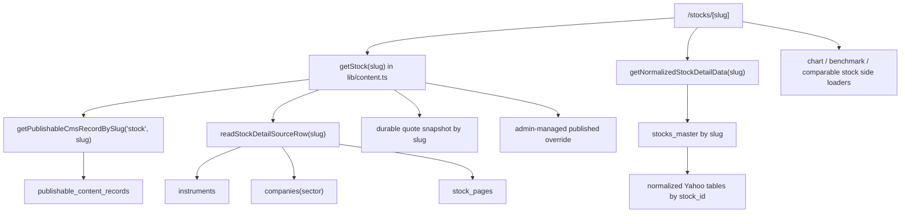
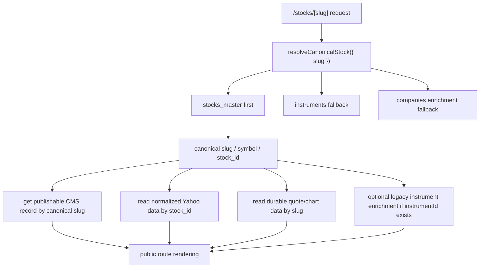

# Riddra Stock Route Migration Dry Run

Date: 2026-04-29  
Scope: dry-run migration analysis only. No production route behavior changed in this step.

## Purpose

Prepare public stock routes and admin stock tooling to use the new canonical stock resolver while preserving:

- current public route stability
- current publishable gating
- legacy `instruments` fallback
- current normalized-data empty-state behavior

This report is based on the live code path as it exists today plus the new [lib/canonical-stock-resolver.ts](/Users/amitbhawani/Documents/Ai%20FinTech%20Platform/lib/canonical-stock-resolver.ts).

## Current Route Flow

### 1. Public stock detail route

Primary entry:

- [app/stocks/[slug]/page.tsx](/Users/amitbhawani/Documents/Ai%20FinTech%20Platform/app/stocks/%5Bslug%5D/page.tsx)

Current flow:

Important characteristics:

- route identity is still driven by `getStock(slug)`
- `getStock(slug)` is publishable-first, not `stocks_master`-first
- normalized Yahoo data is already canonical-first through `stocks_master`
- route rendering is a mixed-layer composition today

### 2. Public stock listing pages

Primary entry:

- [app/stocks/page.tsx](/Users/amitbhawani/Documents/Ai%20FinTech%20Platform/app/stocks/page.tsx)

Current flow:

- calls `getStocks()` from [lib/content.ts](/Users/amitbhawani/Documents/Ai%20FinTech%20Platform/lib/content.ts)
- `getStocks()` starts from `getPublishableCmsRecords("stock")`
- then enriches matching publishable slugs with `readStockCatalogSourceRows()` from legacy `instruments`
- then layers durable snapshots, shareholding, fundamentals, and source-entry closes
- then appends published admin-managed stock fallback rows

Current implication:

- the stock hub is effectively controlled by the publishable stock route set, not by the full `stocks_master` universe

### 3. Chart route

Primary entry:

- [app/stocks/[slug]/chart/page.tsx](/Users/amitbhawani/Documents/Ai%20FinTech%20Platform/app/stocks/%5Bslug%5D/chart/page.tsx)

Current flow:

- `generateStaticParams()` uses `getStocks()`
- page render uses `getStock(slug)` plus `getStockChartSnapshot(slug)`

Current implication:

- chart route availability is coupled to the same publishable + legacy-backed route layer

### 4. Compare routes and link surfaces

Primary consumers:

- [app/compare/stocks/[left]/[right]/page.tsx](/Users/amitbhawani/Documents/Ai%20FinTech%20Platform/app/compare/stocks/%5Bleft%5D/%5Bright%5D/page.tsx)
- [lib/asset-insights.ts](/Users/amitbhawani/Documents/Ai%20FinTech%20Platform/lib/asset-insights.ts)
- [lib/compare-routing.ts](/Users/amitbhawani/Documents/Ai%20FinTech%20Platform/lib/compare-routing.ts)
- [app/charts/page.tsx](/Users/amitbhawani/Documents/Ai%20FinTech%20Platform/app/charts/page.tsx)
- [lib/search-engine/documents.ts](/Users/amitbhawani/Documents/Ai%20FinTech%20Platform/lib/search-engine/documents.ts)

Current implication:

- most internal stock links are derived from `getStocks()` or `getStock()`
- if the stock route universe changes, these surfaces inherit that change automatically

### 5. Admin stock detail loaders

Primary loader:

- [lib/admin-content-registry.ts](/Users/amitbhawani/Documents/Ai%20FinTech%20Platform/lib/admin-content-registry.ts)

Current flow:

- `loadFamilySourceRows("stocks")` -> `getStocks()`
- `loadFamilySourceRow("stocks", slug)` -> `getStock(slug)`
- `getAdminRecordEditorData("stocks", slug, record)` builds editor data from `getStock(slug)`

Current implication:

- admin stock editor is also tied to the public stock source path
- canonical-only stocks in `stocks_master` are not automatically represented in the admin stock editor unless they are also present in the current publishable/public source path or as a manual admin record

### 6. Sitemap

Primary entry:

- [app/sitemap.ts](/Users/amitbhawani/Documents/Ai%20FinTech%20Platform/app/sitemap.ts)

Current flow:

- `getPublishableCmsSlugSet("stock")`
- plus published admin-managed stock fallback rows
- build `/stocks/{slug}` URLs from that merged set

Current implication:

- sitemap inclusion is still keyed to publishability, not to the full canonical stock universe
- this is good for safety and should stay that way until public route rollout is intentional

## Proposed Canonical Resolver Flow

### Migration principle

Do **not** swap public route breadth first.  
Swap **identity resolution** first.

That means:

1. keep the current publishable/public gating
2. keep the current route slugs
3. insert canonical stock resolution underneath those route reads
4. preserve legacy `instruments` fallback during the bridge period

### Proposed flow for stock detail

### Proposed flow for stock listing surfaces

For the first migration stage:

- keep `getStocks()` scoped to the current publishable stock set
- but resolve each publishable stock through the canonical resolver first
- only then layer source enrichment and durable data

This keeps route breadth unchanged while moving stock identity to `stocks_master`.

## Exact Files Needing Changes

## Required first-wave migration files

### 1. [lib/content.ts](/Users/amitbhawani/Documents/Ai%20FinTech%20Platform/lib/content.ts)

Why:

- this is the shared source for `getStock()` and `getStocks()`
- it is the highest-leverage migration point

Expected changes:

- introduce resolver call near the start of `getStock(slug)`
- resolve canonical slug/symbol/stock id before source-row assembly
- use canonical slug for durable snapshot and normalized side lookups
- keep legacy `readStockDetailSourceRow()` as an optional enrichment lane, not the primary identity lane
- introduce a canonical-aware replacement or wrapper for:
  - `readStockCatalogSourceRows()`
  - `readStockDetailSourceRow()`

### 2. [lib/stock-normalized-detail.ts](/Users/amitbhawani/Documents/Ai%20FinTech%20Platform/lib/stock-normalized-detail.ts)

Why:

- it already resolves by `stocks_master.slug`
- it currently duplicates part of canonical identity resolution internally

Expected changes:

- optionally accept a pre-resolved canonical stock input
- or call the canonical resolver instead of directly reading `stocks_master` by raw slug
- preserve all current safe empty states if normalized tables are missing

### 3. [lib/admin-content-registry.ts](/Users/amitbhawani/Documents/Ai%20FinTech%20Platform/lib/admin-content-registry.ts)

Why:

- admin stock detail and list loaders currently use `getStock()` / `getStocks()`
- admin visibility of stock rows depends on this path

Expected changes:

- for stock family only, use canonical resolution-aware loaders
- keep public/admin record assembly unchanged
- do not widen admin stock list to all `stocks_master` rows unless that is an explicit admin product decision

### 4. [lib/publishable-content.ts](/Users/amitbhawani/Documents/Ai%20FinTech%20Platform/lib/publishable-content.ts)

Why:

- stock publishable records still require source-row backing
- development fallback still reads `instruments`

Expected changes:

- keep current publishable gating in production
- update development fallback to prefer `stocks_master`
- review `requiresDurableSourceBacking()` assumptions for future canonical-backed public stock records

## Route consumers that likely need only small follow-up changes

### 5. [app/stocks/[slug]/page.tsx](/Users/amitbhawani/Documents/Ai%20FinTech%20Platform/app/stocks/%5Bslug%5D/page.tsx)

Potential changes:

- optional redirect to canonical slug if resolver finds a different canonical slug
- optional move to pass resolved stock identity into normalized and chart loaders

### 6. [app/stocks/[slug]/chart/page.tsx](/Users/amitbhawani/Documents/Ai%20FinTech%20Platform/app/stocks/%5Bslug%5D/chart/page.tsx)

Potential changes:

- same canonical slug redirect handling
- static params strategy review if/when route breadth expands

### 7. [app/stocks/page.tsx](/Users/amitbhawani/Documents/Ai%20FinTech%20Platform/app/stocks/page.tsx)

Potential changes:

- none if `getStocks()` remains contract-compatible
- review card counts and truth labels after canonical identity migration

### 8. [app/sitemap.ts](/Users/amitbhawani/Documents/Ai%20FinTech%20Platform/app/sitemap.ts)

Potential changes:

- likely none in the first migration wave
- only revisit if public route breadth is intentionally expanded beyond the current publishable set

## Indirect consumers that should be regression-tested

- [app/charts/page.tsx](/Users/amitbhawani/Documents/Ai%20FinTech%20Platform/app/charts/page.tsx)
- [app/compare/stocks/[left]/[right]/page.tsx](/Users/amitbhawani/Documents/Ai%20FinTech%20Platform/app/compare/stocks/%5Bleft%5D/%5Bright%5D/page.tsx)
- [lib/asset-insights.ts](/Users/amitbhawani/Documents/Ai%20FinTech%20Platform/lib/asset-insights.ts)
- [lib/compare-routing.ts](/Users/amitbhawani/Documents/Ai%20FinTech%20Platform/lib/compare-routing.ts)
- [lib/search-engine/documents.ts](/Users/amitbhawani/Documents/Ai%20FinTech%20Platform/lib/search-engine/documents.ts)
- [lib/search-suggestions.ts](/Users/amitbhawani/Documents/Ai%20FinTech%20Platform/lib/search-suggestions.ts)
- [lib/smart-search.ts](/Users/amitbhawani/Documents/Ai%20FinTech%20Platform/lib/smart-search.ts)
- [lib/user-watchlist-view.ts](/Users/amitbhawani/Documents/Ai%20FinTech%20Platform/lib/user-watchlist-view.ts)
- [app/stocks/test-motors/page.tsx](/Users/amitbhawani/Documents/Ai%20FinTech%20Platform/app/stocks/test-motors/page.tsx)

## Current Internal Link Picture

### Safe link generators

These mainly consume `stock.slug` from `getStocks()` and should continue to work if the shared loader contract stays stable:

- stock hub
- compare routing
- chart hub
- search index documents
- smart search / search suggestions

### Hardcoded route exceptions

[app/stocks/test-motors/page.tsx](/Users/amitbhawani/Documents/Ai%20FinTech%20Platform/app/stocks/test-motors/page.tsx) includes hardcoded demo stock hrefs such as:

- `/stocks/maruti-suzuki-india`
- `/stocks/mahindra-and-mahindra`
- `/stocks/ashok-leyland`

These should be reviewed separately because they are not generated from the canonical resolver or from the live publishable stock set.

## Fallback Behavior Plan

The canonical resolver should prepare the route system for migration without removing current safety rails.

### Proposed fallback rules

1. If `stocks_master` resolves the stock:
   - use canonical slug, symbol, yahoo symbol, and stock id
   - continue to read legacy enrichment only when needed and available

2. If `stocks_master` misses but `instruments` resolves:
   - continue rendering through the legacy-backed path
   - mark this as bridge-mode behavior, not the desired end state

3. If `companies` is the only remaining enrichment:
   - use it only to fill identity labels, not as the primary route source

4. If normalized Yahoo tables are empty:
   - keep the current `getNormalizedStockDetailData()` empty states
   - do not convert missing normalized data into route failures

5. If a requested slug resolves to a different canonical slug:
   - first migration wave: log/observe only, or keep rendering without redirect
   - second migration wave: introduce safe redirect after alias coverage is verified

6. If publishable CMS record is missing:
   - preserve the current behavior:
     - published admin-managed fallback if available
     - otherwise `notFound()`

## Risk List

### 1. Publishable gating risk

[lib/publishable-content.ts](/Users/amitbhawani/Documents/Ai%20FinTech%20Platform/lib/publishable-content.ts) filters stock records through `requiresDurableSourceBacking()`.  
If public stock routes are switched to canonical identity without rethinking source-row assumptions, valid canonical rows may still be hidden by the publishable gate.

### 2. Route breadth explosion risk

If `getStocks()` is switched directly from the current publishable set to all `stocks_master` rows:

- `/stocks` hub would expand from `22` routes to the full canonical universe
- compare/chart/search surfaces would expand at the same time
- sitemap and SEO expectations could change unexpectedly

This should **not** happen in the first migration wave.

### 3. Symbol mismatch risk

Known anomaly from prior audit:

- `tata-motors` publishable canonical symbol = `TATAMOTORS`
- `stocks_master.symbol` = `TMCV`
- legacy `instruments.symbol` = `TMCV`

Any canonical route migration must account for symbol alias mismatches like this.

### 4. Admin visibility risk

Admin stock editor currently inherits stock visibility from `getStock()` / `getStocks()`.
If canonical resolution changes identity but not listing policy, some stocks may still remain invisible in admin listing flows unless that is intentionally addressed.

### 5. Build/static params risk

[app/stocks/[slug]/chart/page.tsx](/Users/amitbhawani/Documents/Ai%20FinTech%20Platform/app/stocks/%5Bslug%5D/chart/page.tsx) uses `getStocks()` for `generateStaticParams()`.  
If route breadth expands, static param generation could change significantly.

### 6. Link drift risk

Search and compare surfaces will inherit whatever `getStocks()` returns.  
That means identity migration is safe, but breadth migration must be deliberate.

## Acceptance Criteria

The migration should be considered safe only when all of these pass.

### Identity and rendering

- existing public stock routes still return `200`
  - `/stocks/reliance-industries`
  - `/stocks/tcs`
  - `/stocks/infosys`
  - `/stocks/hdfc-bank`
  - `/stocks/icici-bank`
- route metadata still renders correctly
- `getNormalizedStockDetailData()` still loads by canonical identity with non-fatal empty states

### Public route breadth

- stock hub route count remains intentionally controlled
- sitemap stock URL count does not widen accidentally
- compare and chart route generation still use valid slugs

### Admin behavior

- stock admin editor still loads for published stock routes
- admin family stock rows remain stable
- no regression in public/admin stock `publicHref`

### Fallback safety

- legacy `instruments` fallback still works if a canonical stock route needs bridge support
- missing normalized tables do not crash public stock pages
- canonical resolver mismatch cases are logged or surfaced safely

## Rollback Plan

This migration can be made read-path-only at first, so rollback should stay simple.

### Rollback approach

1. revert `lib/content.ts` resolver integration
2. restore direct legacy `getStock()` / `getStocks()` identity flow
3. keep `lib/canonical-stock-resolver.ts` in the repo as an unused helper if desired
4. clear in-memory route caches
5. re-verify:
   - stock detail routes
   - stock hub
   - chart pages
   - compare pages
   - sitemap generation

### What rollback does not require

- no database rollback
- no data deletion
- no `instruments` deactivation reversal

Because this is a read-layer migration, rollback should be code-only if staged correctly.

## Recommended Migration Sequence

### Step 1

Adopt the canonical resolver inside `lib/content.ts` for stock detail identity only.

### Step 2

Adopt the canonical resolver inside `lib/admin-content-registry.ts` for stock-family editor loading.

### Step 3

Refactor `lib/stock-normalized-detail.ts` to accept canonical resolver output or resolve through it internally.

### Step 4

Switch development fallback and low-risk legacy readers:

- `lib/publishable-content.ts`
- `lib/tradingview-datafeed-server.ts`

### Step 5

Only after that, decide whether to expand public stock route breadth beyond the current publishable set.

## Dry-Run Conclusion

The system is ready for a **resolver-first migration**, but not for a **route-breadth migration**.

Safe now:

- canonical identity resolution
- canonical-vs-legacy bridge logic
- normalized data alignment
- admin stock detail loader migration

Not safe yet:

- deleting `instruments`
- deactivating legacy listings
- widening `/stocks` and sitemap from `22` routes to the full `stocks_master` universe

In short:

Use the canonical resolver to change **how** stock routes resolve.  
Do not change **how many** stock routes exist until the publishable/public route layer is migrated on purpose.
